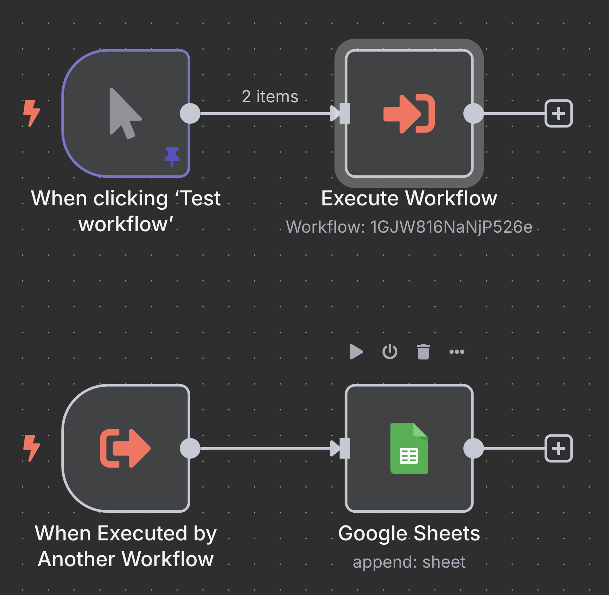
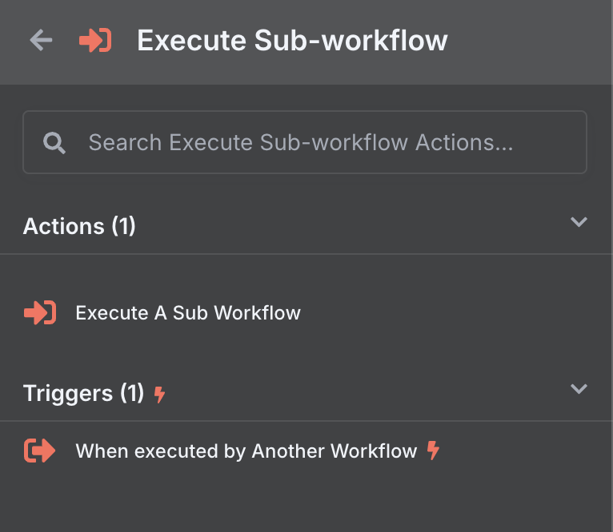
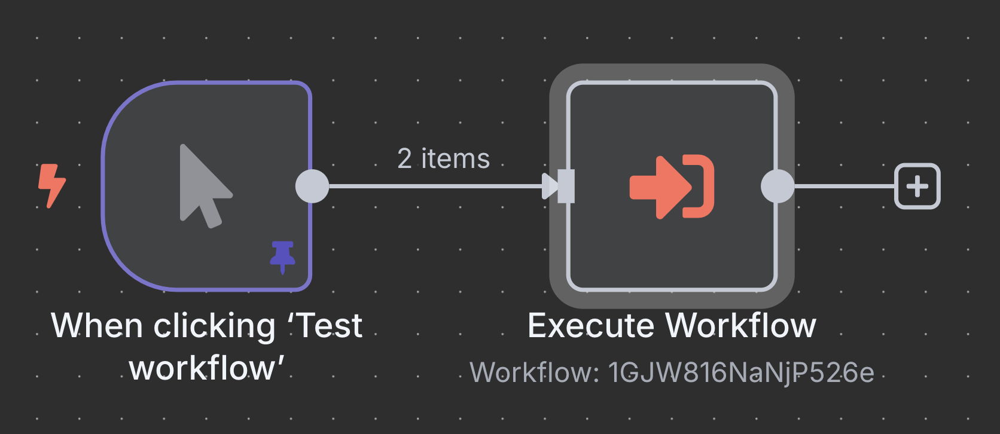
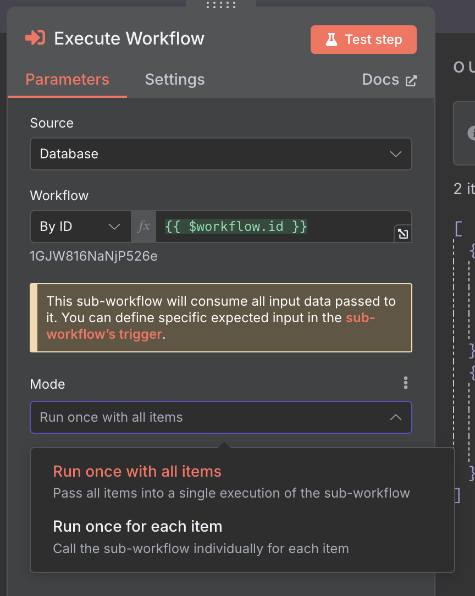
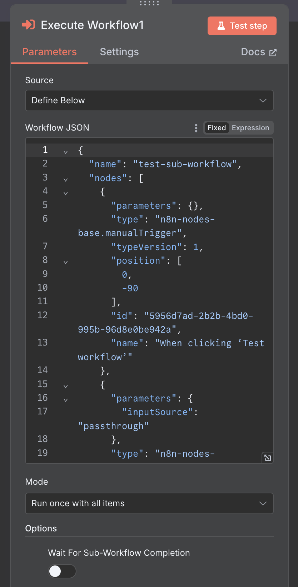
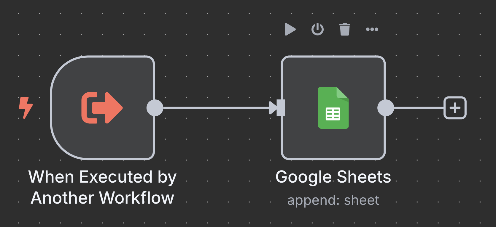
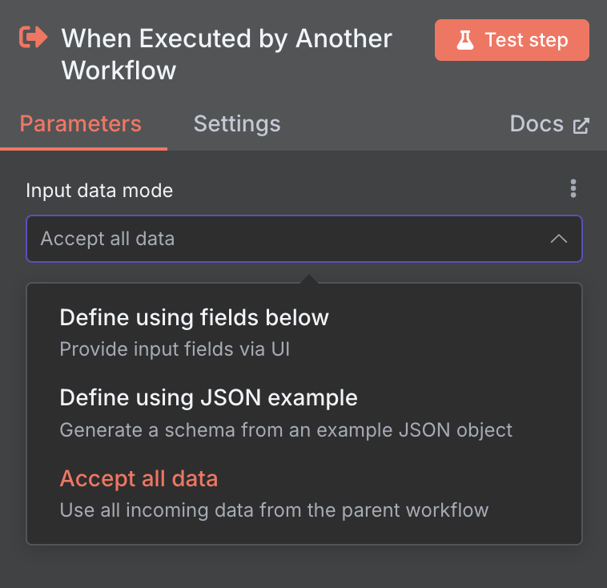
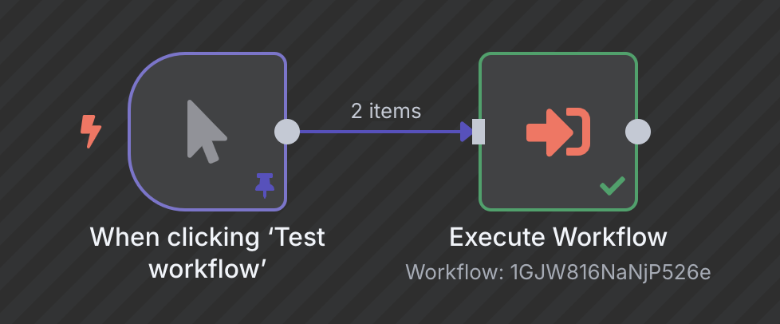
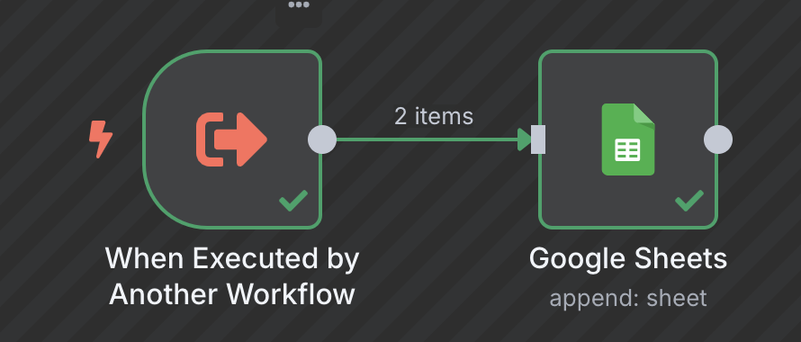
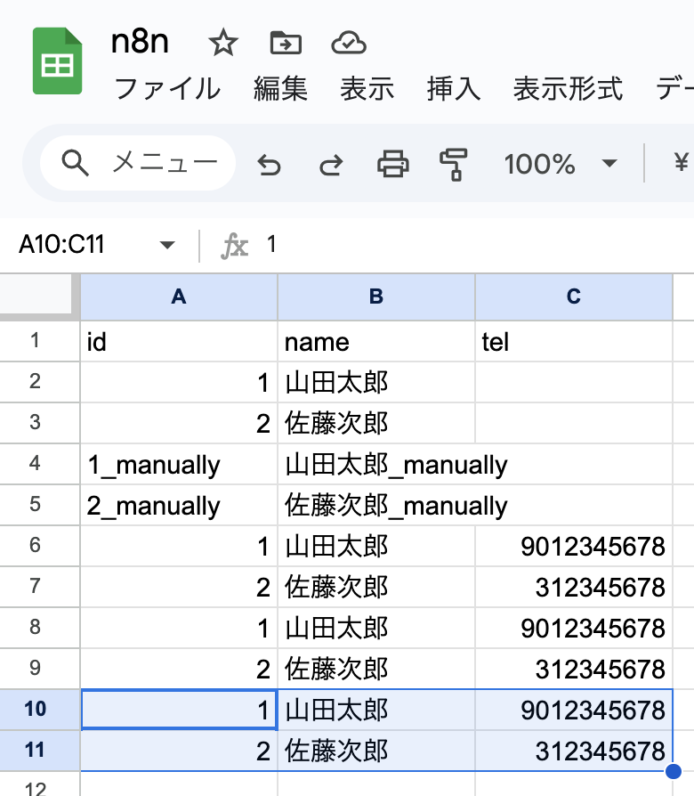

# n8nでSub Workflowを作成して、呼び出して使う
n8nは、1つのワークフロー内に、複数のトリガーを作成することができます。
例えば、Slack Triggerノードと、Schedule Triggerノードを、同じノードに接続する、といったことができるので、トリガー毎にワークフローを作る必要がないのです。

メンテナンスの観点で、1つのワークフロー内でも、責務が異なる場合は、無理矢理多くのノードを接続して事をなすのではなく、できる限り分離したノード接続で構成する方が、テストのしやすさ、問題の切り分け、今後の拡張性といった観点でメリットがあります。   

今回は、単純ですが、Execute Sub Workflowノードを使って、同じワークフロー内のExecute Sub-workflow Triggerノードを呼びだして使ってみましょう。

[Execute Sub Workflowノード](https://docs.n8n.io/integrations/builtin/core-nodes/n8n-nodes-base.executeworkflow)  
[Execute Sub-workflow Triggerノード](https://docs.n8n.io/integrations/builtin/core-nodes/n8n-nodes-base.executeworkflowtrigger)

## ワークフロー全体像

今回のワークフロー全体像は、このような画像です。  
トリガーが2つ存在し、1つはクリックしたとき、もう1つはワークフローから呼び出されたとき。  最後に、ワークフローから呼び出されたときに渡されたパラメータを指定のスプレッドシートに保存していきます。  


## Sub Workflowのアクションとトリガー
使用するアクションとトリガーのノードは、Execute Sub-workflowの中にあります。  
ExecuteA Sub Workflowのアクションで、別のワークフローを呼び出すノードを作成し、When executed by Another Workflowのトリガーで、呼び出しに応えるワークフローの流れを作っていきます。
基本的に、これらは対で使用するので、どちらか一方だけ存在する状態、つまり呼び出すだけ、呼び出されるだけ、を作っても意図する動作はしないので、原則ワンセットで使用することになるはずです。  

### 使用するデータ

この記事で使ったManual Triggerの入力データをそのまま使います。  
[n8nでGoogle Sheetsノードを使って、スプレッドシートにデータを登録する](../n8n-google-sheets-data-entry/index.md)

以下のデータですね。  
```json
[
  {
    "id": 1,
    "name": "山田太郎",
    "tel": "09012345678"
  },
  {
    "id": 2,
    "name": "佐藤次郎",
    "tel": "0312345678"
  }
]
```

## Execute Workflow
Execute A Sub Workflowを選択すると、Execute Workflowノードが現れます。これをWhen clicking Test workflow、つまりManual Triggerに接続します。



Execute Workflowの設定は:
* **Source:** Database  
* **Worfkflow:** By IDで `{{ $workflow.id }}` を指定

**Source** については、呼び出すワークフローの指定方法で、今回はIDを直接指定しています。  
n8nは、`{{ }}` で囲うことで、変数を使う事ができますので、直接ID ここでは `1GJW816NaNjP526e` を指定することなく、実際に動かすワークフローを変数で指定する方式を採用しています。  
基本的にこういったIDを直接ハードコードするより、変数化されたものを使う方が、使い回しが良かったりするのでオススメです。  
別のIDの指定方法としては、 `From list` が存在しますが、これも同じように現在利用可能なワークフローをn8nに選択肢を与えて貰う方式で、その中から選ぶ、と言うことも可能です。  



**Source** は、他にもn8nのプロジェクトファイル（JSONフォーマット）を、ベタ書きする方式もあります。これは、n8nのプロジェクトにワークフローとして作成せずに、ここに記載したWorkflow JSONに則り実行する、というものです。  
個人的には、ここにベタ書きするメリットを今時点では感じられる、普通にWorkflowsに現れる形でワークフローを保存したものを使うで良いと思いますが、他の人に知られたくないといったケースの場合に有用かもしれません。  

## Trigger By Another Workflow
別のワークフローから呼び出されたときに、実行したい場合に When Executed by Another Workflowをトリガーで使います。  
ポイントは、同一ワークフローでも別のファイルのワークフローでも、兎に角呼ばれると、ここがトリガーされます。


When Executed by Another Workflowの設定は、シンプルに **受信した全てのデータを受け入れる** という設定のみです。  
他にも、個別にJSONフォーマットで指定、もしくはフィールドを個別にUIで指定する方法も存在します。  
詳しい解説は、別の機会に行おうと思います。  


## Manual Triggerを実行してみる
Manual Triggerを実行すると、直ぐに接続する Execute Workflowを実行します。  
このとき、パラメータとして渡すものは自由に設計できるのですが、今回はManual Triggerに設定した入力データ全てが配列のまま送信されます。


続けて、When Executed by Another Workflowが呼ばれます。  
今回のこのトリガーのパラメータは、入力したデータ全部が一気に渡ります。  
そしてそのまま、スプレッドシートに保存します。


## まとめ
Sub Workflowの呼び出しについていかがだったでしょうか。  
呼び出す方、呼び出される方、ともに様々なパラメータの受け渡し方法がありますが、呼び出す側は入力に責務を置き、呼び出される側は与えられたパラメータをしっかり処理する、という互いの関心事に注力できるのが、良い点だと思います。  
現実のプログラム作業も、責務に応じて適切に分離することが良いとされていますので、可能な限り人間にも機械によっても分かり易い分離を心がけるべきだと思います。  ****
