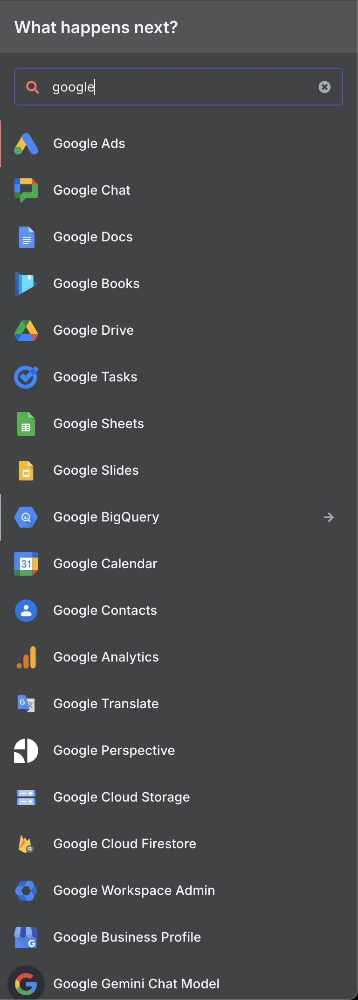
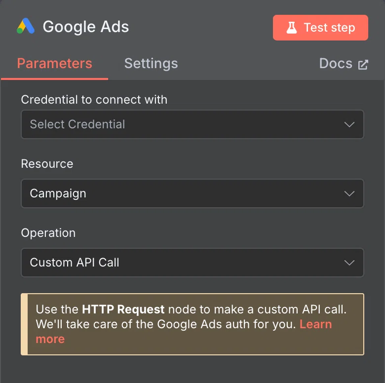
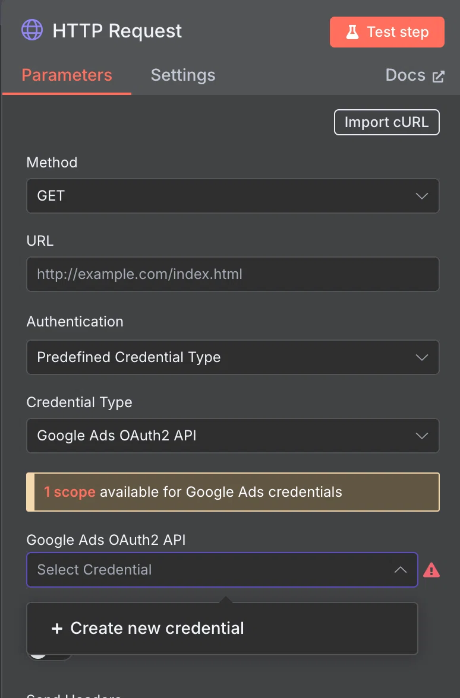

# n8nでGoogleサービスを使うためのクレデンシャル4選【用途別に解説】

## n8nでGoogleサービスを使う方法

n8nは、多くのGoogleサービスを提供しています。Googleサービスを使うためには、クレデンシャルの作成が必要です。  
n8nでは、複数種類のクレデンシャルの登録が可能ですが、それぞれ異なる仕様であるため、改めてここで詳しく説明していきます。

### 4つのGoogleクレデンシャルの設定方法

大きく4つの種類が存在します。  
これら違いについて、簡潔に説明します。  

[Google credentials](https://docs.n8n.io/integrations/builtin/credentials/google/)

* [OAuth2 Single Service](https://docs.n8n.io/integrations/builtin/credentials/google/oauth-single-service/)
* [OAuth2 Generic](https://docs.n8n.io/integrations/builtin/credentials/google/oauth-generic/)
* [Service Account](https://docs.n8n.io/integrations/builtin/credentials/google/service-account/)
* [Google PaLM and Gemini](https://docs.n8n.io/integrations/builtin/credentials/googleai/)

### Custom API

n8nには多数のGoogleサービス用ノードが用意されていますが、それでも一部のAPI機能にアクセスできないケースがあります。  
そういった場合には「Custom API Call」機能を活用することで、任意のGoogle APIエンドポイントにリクエストを送ることができます。

Custom APIでは、各種Google認証（OAuth2 Genericなど）と組み合わせることで、公式ノードにないAPIも使えるようになります。

[Custom API operations](https://docs.n8n.io/integrations/custom-operations/)

### カスタムAPIオペレーションとは？

n8nで用意されていないAPIの操作（エンドポイント）も、自分で **カスタム操作** として追加できます。  
これにより、既存ノードの中でカスタムAPIリクエストができるようになります。

### どんなときに使う？

* ノードに存在しないAPIリクエストを使いたいとき
* 頻繁に使うAPI呼び出しを再利用可能な形式にしたいとき

### どこにカスタム操作を追加するの？

多くの認証対応ノードでは、「**リソース**」や「**Operation**」の選択項目があります。

1. 対象ノードを選択
2. 「Operation」で Custom API Callを選ぶ

### Custom API Call

ここまで来ると、結局はHTTP Requestノードで、リクエスト情報を指定して送ることになるのですが、  
そのときに、 **Predefined Credential Type** で **Google XXX OAuth2 API（e.g. Google Ads OAuth2 API）** を選んで使用することで、n8nノードで用意されていない機能も使うことができる、という仕組みです。

## Google OAuth2 Generic (google.oauth2)

### どんなときに使う？

Googleの任意のAPIをユーザー認証で使いたいときに使います。

### 主な対象

Gmail, Drive, Calendar など

### 認証の仕組み

OAuth 2.0 認可コードフロー（ユーザーがログインして許可）

### 代表的なノード

HTTP Request + Custom API Call など

## Google OAuth2 Single Service (google.oauth2.service)

### どんなときに使う？

Googleのユーザー系APIをサービスアカウント経由で自動操作したいとき

### 主な対象

Gmail, Drive, Calendar など

### 認証の仕組み

JWTベースのOAuth（OAuth 2.0 JWT Flow）

### 代表的なノード

Gmailノードなど（Service Account対応時）

## Google Service Account （google.serviceAccount）

### どんなときに使うの？

GCPのAPIにサーバー間でアクセス

### 主な対象

BigQuery, Cloud Storage, Firestore など

### 認証の仕組み

秘密鍵で直接APIに署名して認証

### 代表的なノード

BigQueryノードなど

## 「OAuth2 Generic」と「OAuth Single Service」の決定的な違い

**OAuth2 Generic** は、ユーザー自身がログインして許可を与えることでGoogle APIにアクセスする認証方式です。  
この方法では、実際のユーザーが操作しているものとしてGoogleに認識され、カレンダーやGmailなど個人のデータへアクセスできます。  
UI上でのログインと同意が必要ですが、ドメインワイドな設定は不要で、比較的簡単に使えます。  
カスタムAPIにも柔軟に対応できます。

一方、 **OAuth Single Service** は、Googleの「サービスアカウント（仮想ユーザー）」を使って、ユーザーの代わりに自動で操作を行う認証方式です。  
ユーザーが手動でログインする必要はなく、バックグラウンド処理に適しています。  
ただし、対象のユーザー（社内メンバーなど）のデータにアクセスするには、Google Workspaceの管理者による **ドメインワイド委任** の設定が必要です。  
カスタムAPIにも対応できますが、管理者権限が求められる点に注意が必要です。

### 例で見ると

たとえば、 **自分自身のGoogleカレンダーをn8nから読み書きしたい場合** は、最も簡単で手軽な認証方法である「**OAuth2 Generic**」を使うのが適しています。  
この方式では、ユーザー自身がGoogleにログインして権限を付与することで、個人のGoogleサービスにアクセスできます。

一方で、 **社内の全メンバーのGoogleカレンダーを一括で取得したい場合** のように、複数のユーザーデータを対象とする場合は、サービスアカウントを使った「**OAuth Single Service**」が必要になります。  

また、 **GCP（Google Cloud Platform）** の **Cloud Storage** に自動でファイルをアップロードしたい場合など、  
Google Workspaceのユーザーデータではなく **GCPリソース** を操作したいケースでは、「**Service Account**」を使うのが最適です。  
これはIAM権限によってアクセス管理されており、ユーザーの同意やログインを必要としません。

## Google AI Credential（Gemini・旧PaLM API）
これは、 **Gemini（旧PaLM API）をn8nで呼び出すための「APIキー」ベースの認証方法** について解説しています。

[Using Gemini(PaLM) API key](https://docs.n8n.io/integrations/builtin/credentials/googleai/#using-geminipalm-api-key)

Gemini（旧PaLM）APIは、Googleの生成AI機能を呼び出すためのAPIです。  
これまでの認証方式（OAuthやサービスアカウント）とは異なり、 **APIキーだけで簡単に利用できます。**  

### 使用する認証方式：APIキー（API Key）
* 他のGoogleサービスとは違い、OAuth2やService Accountは不要
* Google Cloud Consoleで「Gemini API」を有効化し、APIキーを発行
* n8nの Google AI Credential にそのAPIキーを貼り付けるだけ

## まとめ
* **個人のGoogleアカウントを使って手軽に連携したい** 場合は  
→ **OAuth2 Generic**
* **会社のGoogle Workspaceで、ユーザーごとの操作を自動化したい** 場合は  
→ **OAuth Single Service**
* **BigQueryやCloud Storageなど、GCPのリソースを操作したい** 場合は  
→ **Service Account**
* **Google AI Credential** は、**生成AI向けの一番簡単な認証方式（APIキーだけ）**