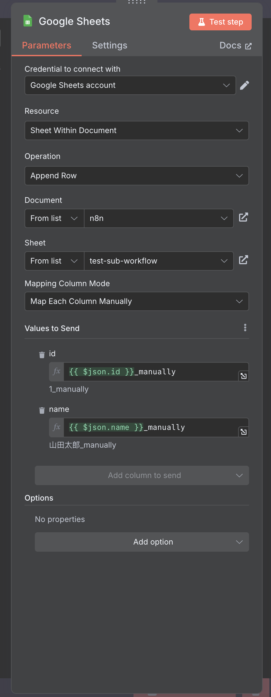

# n8nでGoogle Sheetsノードを使って、スプレッドシートにデータを登録する

n8nでは、Google Sheets APIを使って、データ登録ができます。  
Google Sheets に関するActionやTriggerは以下のように各種揃えています。  
今回は、この中でも「Append row in sheet」をやってみたいと思います。


## Google Cloudでクレデンシャルを作る

Google Sheets、もといGoogleサービスを使うためには、Google Cloudでプロジェクトを作成し、クレデンシャルを扱えるようにする必要があります。  
n8nでGoogleサービスを使うためのクレデンシャルの登録方法については、別途解説した記事がありますので、そちらを参照ください。  
[n8nでGoogleサービスを使うためのクレデンシャル4選【用途別に解説】](../n8n-google-credentials/index.md)

## Google Sheets Actionを使ってみる

### Google Sheetsアクションの追加
Google Sheetsの中から `Append row in sheet` Actionを選んでください。  
以下の図の通り、Google Sheetsノードを今回はManual Triggerに繋げました。  


### Google Sheetsノードの設定

Google Sheetsノードの設定の内、Documentについては、クレデンシャル取得可能なスプレッドシートが自動的に、`From list` に現れましたあ。

ドキュメントを選択すると、次にドキュメントに存在するシートが選択できるようになります。  


### Manual Triggerノードの設定
トリガーとなるManual Triggerノードに、テストデータを設定しておきます。  


### Manual Triggerノードの実行

さて、ここで準備が整いました。  
Manual Triggerノードをマウスオーバーすると、Test Workflowボタンが表示されるので、実行してみます。  


ワークフローが成功！


### スプレッドシートに追加する仕組み

Google Sheetsノードの設定にある「Mapping Column Mode」が `Map Automatically` に設定されていると、  
前ノードから受け取ったJSON構造がそのまま列と行へ反映されます。

今回は、Manual Triggerノードに設定した以下のデータで、配列の構造になっているので、その分だけ行が登録されます。  
列は、1要素あたりの辞書のキーで、今回は `id`、 `name` の2つが列として登録された形です。

```json
[
  {
    "id": 1,
    "name": "山田太郎"
  },
  {
    "id": 2,
    "name": "佐藤次郎"
  }
]
```

スプレッドシートで既に同名の列が存在する場合は、次の行に同名の列（e.g. `id`）が作られることはないです。  

### スプレッドシートに追加する要素を足してみる

Manual Triggerノードのデータに、`tel` を追加しました。

```json
[
  {
    "id": 1,
    "name": "山田太郎",
    "tel": "09012345678"
  },
  {
    "id": 2,
    "name": "佐藤次郎",
    "tel": "0312345678"
  }
]
```

さらに、Mappingを明示的に設定します。ついでに、各データの後ろに `_manually` というテキストを追加するように設定しました。



これを実行するとどうなるでしょう。


手動設定自体は、期待通り登録されましたね。しかし、`tel`が登録されませんでした。  
試しにマッピングを自動に戻すと...  


期待通りですね！

### スプレッドシートの変化を監視している

ちなみに、スプレッドシートに列を追加すると、その変化をn8nは直ぐに検知します。  
n8nで認識するカラムと異なるよ、という警告ですね。  
隣のリフレッシュボタン押下することで、n8nも新カラムを認識するようになります。


