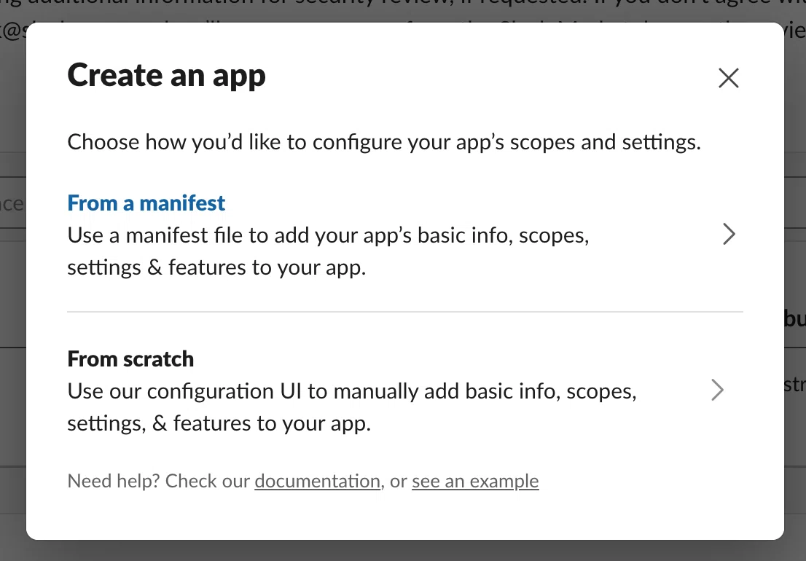
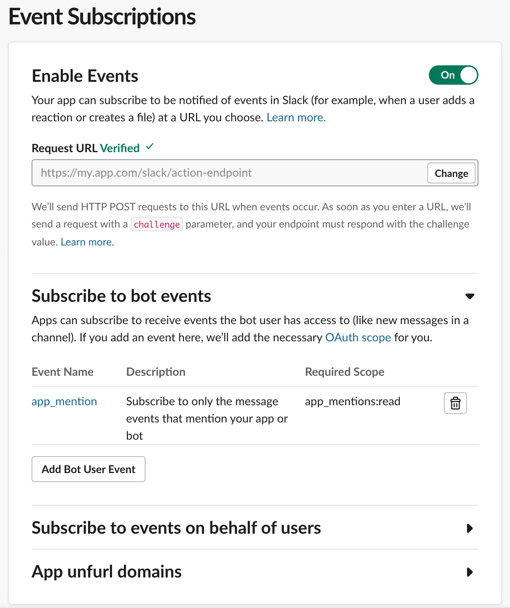
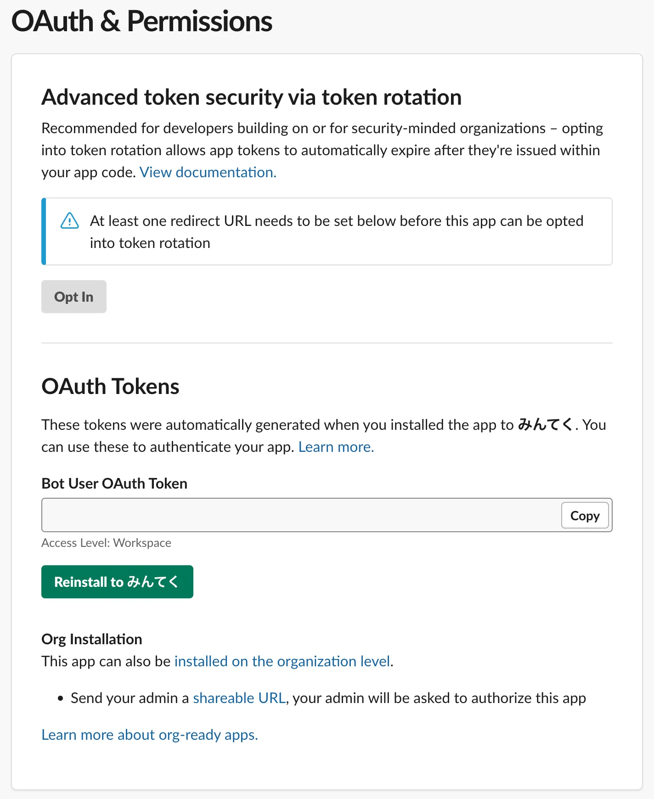
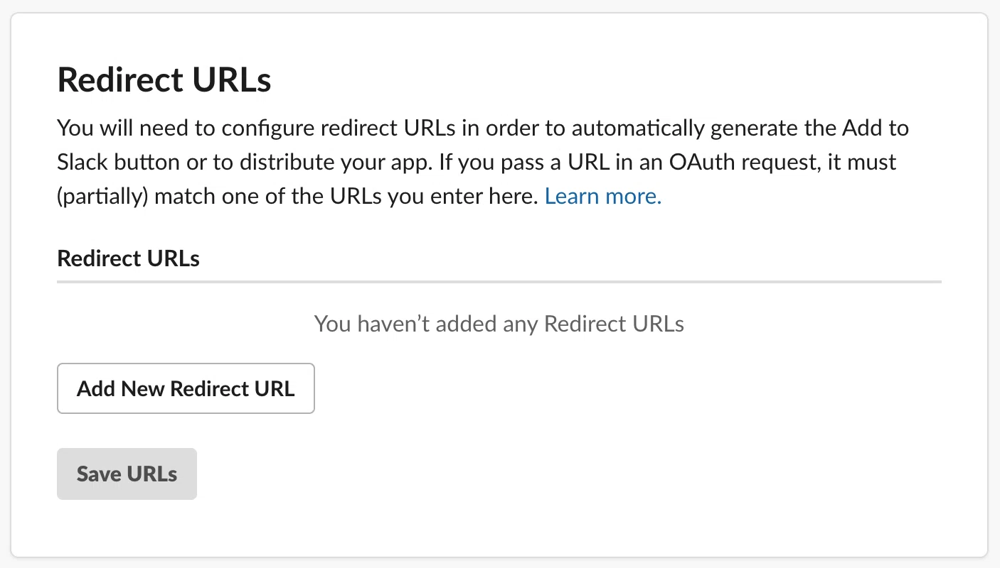
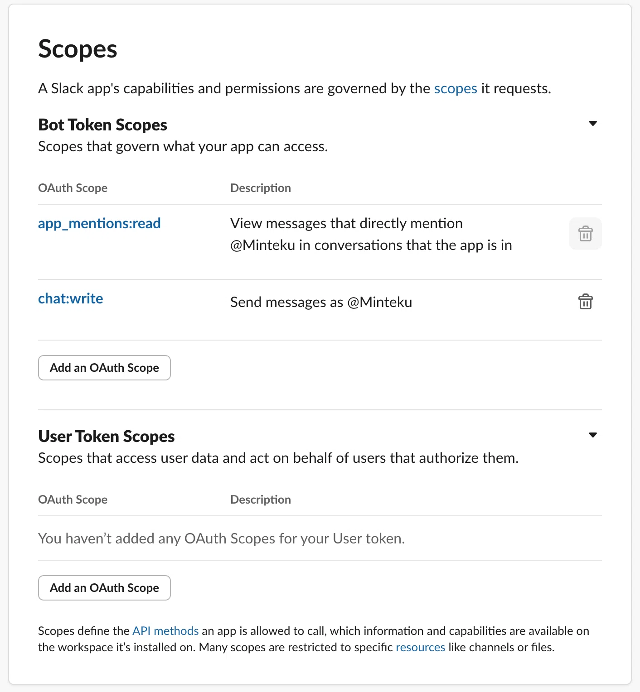
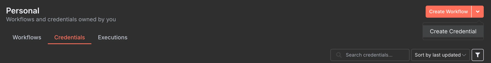
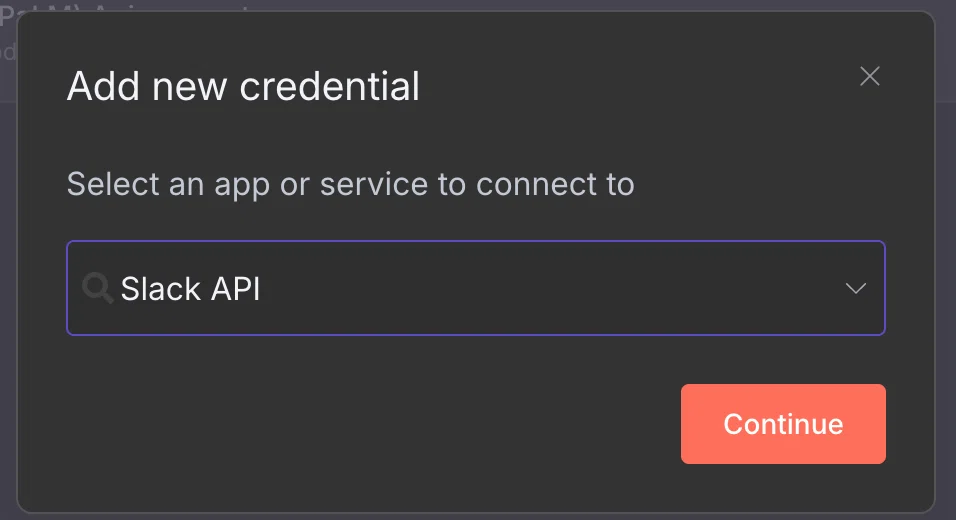
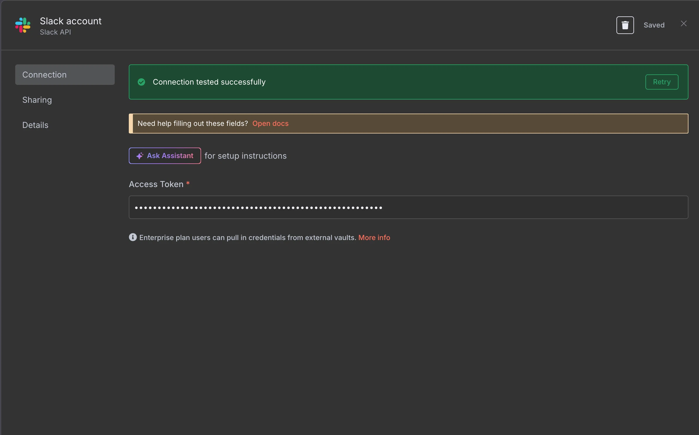
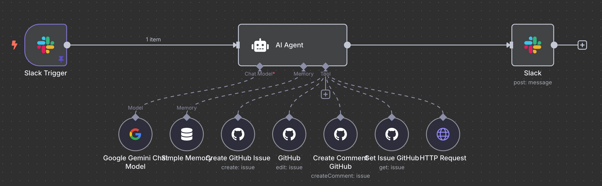
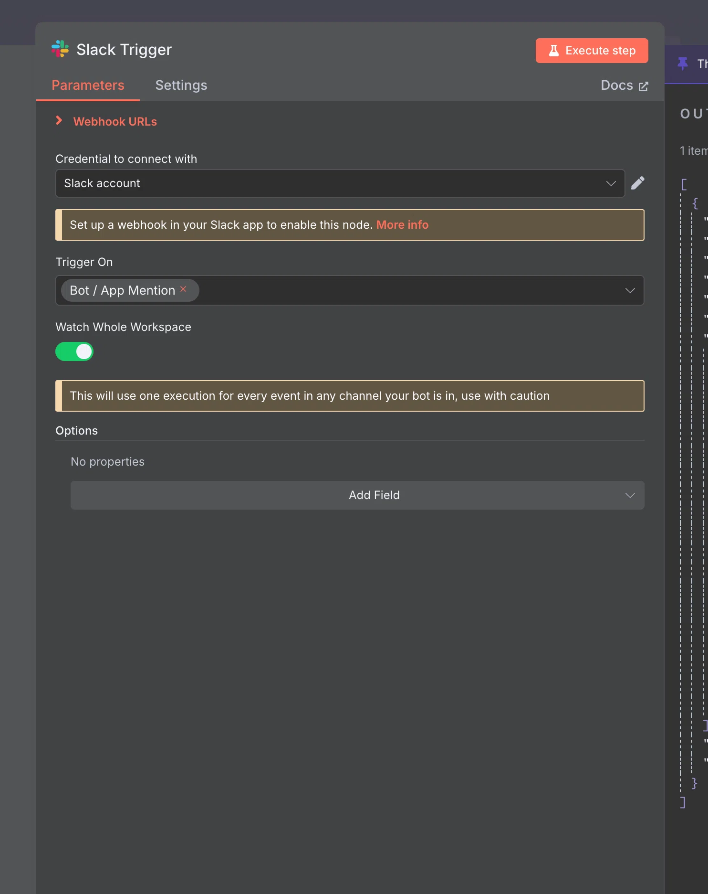

# n8nとSlack Bot連携でSlackからのメッセージを自由自在に処理！業務効率化を加速させる方法

Slackは、現代のビジネスコミュニケーションに欠かせないツールです。  
しかし、Slack上の情報を手動で処理するのは時間と手間がかかります。  
そこで、n8nとSlack Botを連携させることで、Slackからのメッセージを自動的に処理し、業務効率を飛躍的に向上させることができます。

この記事では、n8nとSlack Botを連携させる方法をステップバイステップで解説します。さらに、具体的な活用例も紹介し、あなたのビジネスにおける可能性を広げます。

## n8nとSlack Bot連携のメリット

### メリット

n8nとSlack Botを連携させることで、以下のようなメリットが得られます。

* **自動化による業務効率化:** Slack上の情報を自動的に処理することで、手作業による時間と手間を削減できます。
* **リアルタイムな情報処理:** Slackからのメッセージをリアルタイムに処理し、迅速な対応を可能にします。
* **柔軟なカスタマイズ:** n8nの豊富なノードを活用することで、様々な処理を自由にカスタマイズできます。

データの一元管理: Slack上の情報を他のシステムと連携させることで、データの一元管理を実現できます。

### 準備

n8nとSlack Botを連携させるためには、以下の準備が必要です。n8nのインストールとSlackワークスペースの準備は、本記事では割愛させていただきます。  
軽く触れておくと、n8nについてはクラウド版を使う場合は、トライアル付きの有料プランが基本で、ローカル環境の場合はDockerコンテナで起動できます。

* **n8nのインストール:** n8nをローカル環境またはクラウド上で動かせる準備をします。
* **Slackワークスペースの準備:** Slack Botを連携させるワークスペースを用意します。
* **Slack Appの作成:** Slack APIを利用するために、Slack Appを作成します。

## Slack Appの手順

ここでは、特定のチャンネルに対して、これから作成するSlack Botに対してメンションされることをトリガーに想定した設定になります。そのため、Slack Appに関する設定は最小限に留めているので、必要に応じて設定を追加してください。

ポイントは:  
1. From scratchでアプリ作成  
2. Event Subscriptionsの設定  
3. OAuth & Permissionsの設定  
4. ワークスペースにInstall5. Slack Botのアクセストークンをn8nに設定

[Slack App](https://api.slack.com/apps)

### From scratchでアプリ作成

### Event Subscriptionsの設定

Slack Botにメンションが来たらn8nに通知する設定です。  
Enable EventsをOnにし、Request URLを設定、Event Nameは app_mention を加えることで、ここの設定は大丈夫です。  
Request URLは、n8nのSlack TriggerのWebhook URLを入力してください。

### OAuth & Permissionsの設定

OAuth & Permissionsの全体的な設定を紹介します。  
先に、Scopesで `chat:write` を追加しておきます。  
これで、Slack Botがチャンネルにメッセージを投稿できるようになりました。  
初めてSlackアプリをワークスペースにインストールするときは、「Install to XXX」 と表示されますが、  
私の場合は既にインストール済みなので、「Reinstall to みんてく」というボタンで表示されます。  
このボタンをクリックして、必要な権限を確認・付与し、アプリをワークスペースにインストールします。  
Install後は、`Bot User OAuth Token` をn8nに設定します。

## n8nの手順

### Slack Botのアクセストークンをn8nに設定

Bot User OAuth Tokenをn8nのクレデンシャルに登録します。

### Slack Triggerのワークフロー作成

Slackからメンションなど、ある程度のトリガーをカバーしたSlack Triggerを使います。

全体のワークフロー例

Slackのワークフロー全体に適用したい場合は、Watch Whole WorkspaceをONにしておきます。  
Trigger Onも各種揃えていますが、今回はメンションに対応するだけで良いので、Bot / App Mentionを選択。  
Webhook URLsをクリックすると、テストと本番の2つのタブが現れ、それぞれ異なるURLの一方をSlack AppのEvents Subscriptionsに登録します。

具体的なワークフローの解説は、別の機会にしますが、Slack Triggerを上手に使うことで、様々な業務フローで活用できます。

## 具体的な活用例

n8nとSlack Botの連携は、様々な業務に活用できます。以下に具体的な活用例をいくつかご紹介します。

* **タスク管理:** Slackでタスクを依頼された際に、自動的にタスク管理ツール（Github, Asana, Trelloなど）にタスクを作成する。
* **顧客対応:** Slackで顧客からの問い合わせがあった際に、自動的にCRM（Salesforce, HubSpotなど）に情報を登録する。
* **情報収集:** 特定のキーワードを含むSlackメッセージを検知し、自動的にGoogle Sheetsに記録する。
* **アラート通知:** サーバーの異常を検知した際に、Slackチャンネルに自動的に通知する。
* **アンケート収集:** Slackでアンケートを実施し、回答結果を自動的に集計する。

## n8nとSlack Bot連携におけるTipsと注意点

Slack Appの権限: Slack Appに必要な権限を適切に設定することが重要です。  
必要以上の権限を与えないように注意しましょう。

* **エラーハンドリング:** ワークフローにエラーハンドリングの仕組みを組み込むことで、予期せぬエラーが発生した場合でも、ワークフローが停止するのを防ぎます。
* **セキュリティ対策:** Slack Appの認証情報を安全に管理し、不正アクセスを防ぐための対策を講じましょう。
* **ワークフローの最適化:** ワークフローの処理速度を向上させるために、不要な処理を削除したり、処理順序を最適化したりすることを検討しましょう。
* **ドキュメントの整備:** ワークフローの内容や設定方法をドキュメントとして整備することで、メンテナンスや引き継ぎが容易になります。

## まとめ

n8nとSlack Botを連携させることで、Slackでのコミュニケーションを自動化し、業務効率を飛躍的に向上させることができます。  
この記事を参考に、ぜひn8nとSlack Botの連携に挑戦し、日々の業務をよりスマートにしていきましょう。